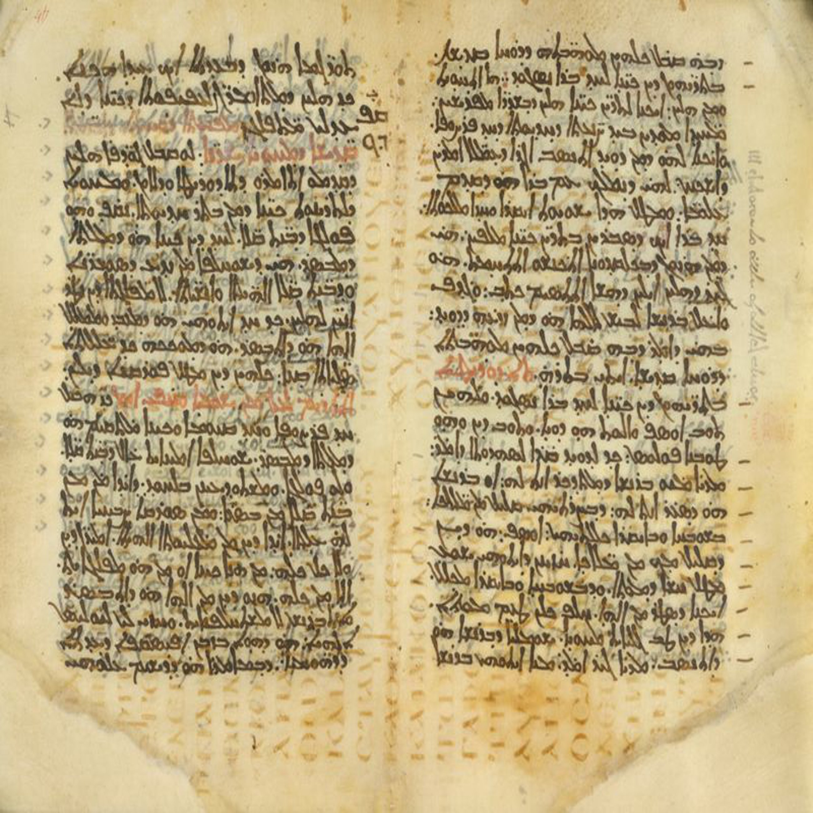
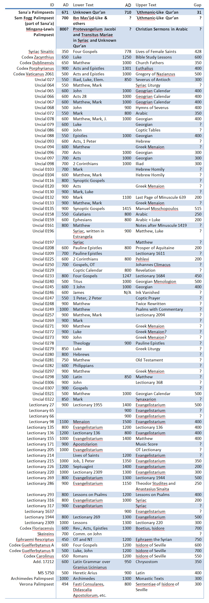

Palimpsests are ancient documents that have two or more layers of writing. The term “palimpsest” literally means “scraped-over” in Greek and refers to the way in which the document was recycled. Due to high cost of parchment in the ancient world, ancient scribes would occasionally reuse parchment by scraping the ink off with a razor and writing new text (upper text) over the old one (lower text).

Christian monks are responsible for the bulk of preservation of ancient documents. The practice of making palimpsests was so common that it was banned around 9th century, because the monks would scrape almost any old book that they could get their hands on to save money on paper. Most of them are worn-out copies of the canonical gospels, which were scraped to make room for later Christian prose.

While there is a possibility that some books may have been destroyed this way on purpose, the text of most palimpsests has been recovered with the help of modern technology. Ultraviolet light and some chemicals make old ink glow on photographs even after the ink has been scraped off and with several layers of text written over it. The recovered text is demonstrably not any more irregular than other copies of the text from the same time period made on clean paper.

There are over 100 palimpsests that have survived until today. Below is a list of every ancient palimpsest that I could find. The list was produced to support general observations about all palimpsests. I will state two general observations and explain their historic significance. Then, I will make a few remarks regarding the only two surviving Qur’anic palimpsests.

### Observation 1: The Gap Between Lower and Upper Texts is Usually 350 Years
Most palimpsests were scraped 350 years after the lower text was completed. The scribes probably considered the lower text to be too worn out to be useful. Since most of the upper text also dates past 800 AD, the scribes were confident that they were not destroying valuable information, because the textual tradition had long become stable on the works that they were scraping.

### Observation 2: Upper Text Usually Contains New and Different Material
Almost all scribes wrote something different on palimpsests from what was previously written. Some famous scribal groups buried worn out books instead of scraping them to show respect to sacred writings. It is likely that sacred texts were rarely written on scraped parchment because the scribes held their sacred texts in such high regard. New copies of the Bible were rather expensive and only the best parchment was used to produce them. Old and worn-out paper was used more for the less important writings.

## Sana’a Palimpsests
The earliest copies of the Qur’an flatly defy general observations 1 and 2 listed above. The gap between lower and upper texts is only about 30-50 years instead of expected 350. And, lower and upper texts are both portions of the Qur’an. This strongly implies that the Qur’an may have been altered on purpose, since the lower and upper texts in this palimpsest overlap. Both layers were edited after they were written, and neither fully conforms to the modern text.

The mosque in which Sana’a manuscripts were discovered was built by one of Mohammad’s close associates. Money for getting good paper for the Qur’an in Yemen should not have been a problem in 710 AD. Around this time Muslims conquered most of Spain and Transoxiana. If they were short on paper, it would make more sense if they scraped some of the other available books. If they wanted to produce a better official copy, it would have been much better to use new parchment and burn the old copy. It seems that the text of that particular Qur’an in Sana’a had to be changed for some reason, and making a new copy wouldn’t suffice.

## Mingana-Lewis Palimpsest
Dr. Alba Fedeli is currently digitizing and re-transcribing this palimpsest. I am eagerly waiting for the results. Preliminary examination shows that portions of the Qur’an were mixed together with some Christian Syrian Apocryphal writings. This fact may partly support Luxenberg’s thesis.

In his book “The Syro-Aramaic Reading of the Koran,” Christoph Luxenberg argues that Qur’an is an edited form of Syro-Aramaic lectionary produced by Christians for liturgy in Iraq in order to convert Arab Bedouins. The word “qur’an” itself is a loan-word from Aramaic. It means “lectionary.” Luxenberg’s thesis is highly controversial and, despite its popularity with public media, seems rather speculative. Dr. Fedeli’s re-examination of Mingana-Lewis Palimpsest may turn up new important information.

As a historian, I find it extremely strange that one of the earliest portions of the Qur’an is together with Syriac Apocrypha in this palimpsest. Those things do not belong together at all, if we accept the classic narrative of the history of Islam. The upper text is a set of Christian sermons in Arabic! The textual roots of this Qur’an are unclear. Mingana thought that it was three different and unrelated Qur’ans.

I do not want to make any hasty conclusions until Dr. Fedeli’s study is complete. Her findings may completely overturn Mingana’s earlier observations. For now, please note how unusual and strange the content of this material compared to other extant palimpsests.

## Conclusion
The only two Qur’anic palimpsests stand out compared to all other known palimpsests in some rather curious ways. More study is needed to determine full significance of the differences. Early observations, however, cast doubt on the classic history of Qur’an’s formation.

