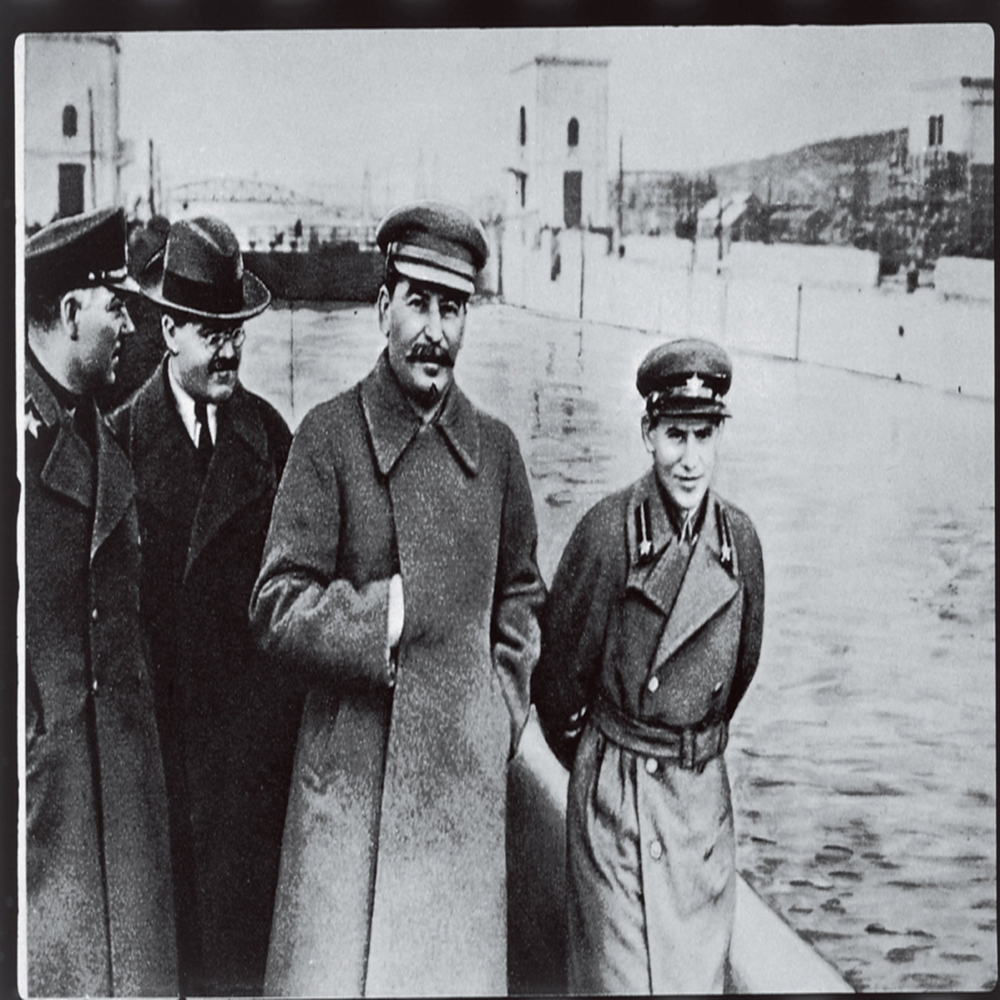
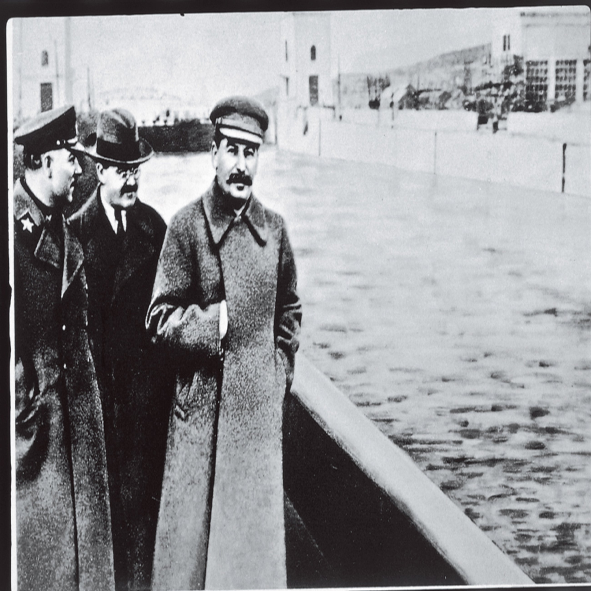

It is impossible to lie about the present without perverting the memory of the past. Controversial matters are all rooted to historical assertions. An impasse in communication is best approached by a search for those assertions followed by their evaluation. They are seldom obvious and explicit because effective propagandists suppress their discovery. Manipulation of conscience remains effortless as long as historical assertions at the heart of each controversy are veiled by a thick coagulation of loud misguiding assumptions.

Before | After
-------|------
 | 

The aim of a propagandist is to sabotage the conversation by keeping it around the peripheral and sensational matters and as far away from the root historical assertions as possible. This strategy works even when recognized. If you accuse the propagandist of being manipulative, this too becomes a distraction from the historical root of the controversy in question. Even when stubbornness prevails over anger and exhaustion of a heated argument, and one of the root historical assertions is brought to light, we fail to capitalize on the benefit of such great achievement. We do not know how to weigh conflicting historical claims. What is the right way to do history?

Special Considerations
----------------------

Historians follow a loose convention that they rarely explain. It boils down to a strong preference for earlier sources and general conformity to dates and sequences established by the scholarly majority. Beyond that, each historian does his own thing to present a certain overarching narrative peculiar to them. Perhaps you do the same, and this approach will surely be enough for recreational reading. However, if you are attempting to compare conflicting historical claims and build an argument hoping to convince another person to change their mind, you must find something else to add to: "I once read in a history book that is not like your history book..."

Historical method is difficult to standardize. Nothing that has occurred can ever be fully repeated or recovered. This is dictated by thermodynamics. Nothing that has occurred can ever be perceived or understood the same way. This is dictated by psychology. Our connection to the past is restricted to fragmentary impressions of persons who are generally not available for an interview. Those impressions can only be lifted from folklore, archeology and literature. That is it! Most of the old stuff is wrecked when it is first found. Almost all of the ancient literature has been lost, and what remains is contradictory and heavily edited. So how can you know that something is historically true?

Truth Grid
----------

Historical claims are essentially estimates of probability. It is hard to prove them categorically true or false. They are rather deemed probable or improbable based on evidence. The best of probabilities is the closest that we are going to get to rational truth, so that is what we call "historical truth." Historical claims are often overturned due to discovery of new evidence. The word "truth" here is used as a scientific term. All our verbalizations are approximations of observed reality including historical claims. This approximation is good enough to be called "truth" because we do not have any other currency to reasonably trade with each other.

A propagandist will often try to bait you into proving that his theory is false. Do not fall for the bait - proving an absolute negative is not reasonable or empirically possible. You cannot prove something never happened just like you cannot prove that something does not exist. The evidence for non-existence is nothing. The burden of proof is in demonstrating positively that one explanation is superior. In other words, historical truth is the best explanation chosen out of a set of possible explanations that satisfy the following requirements:

1. Given explanation harmonizes most of the relevant historical facts.
2. Given explanation includes reasons for the existence of some contradictory facts.
3. Given explanation coherently traces the journey from causes to consequences.
4. Given explanation overlaps with patterns observed in similar situations.
5. Given explanation contains little conjecture.

Most propaganda constructs fail to satisfy several of those requirements. When facing several competing explanations that meet all of the criteria above, the best one is judged by comparing each by its selection of source material. Primary sources should exhibit the following qualities:

1. Primary sources relay the closest possible eye witness testimony.
2. Primary sources are chronologically close to the events described.
3. Primary sources are geographically close to the events described.
4. Primary sources are internally consistent to a large extent.
5. Primary sources include plenty of verifiable details (names, places, etc.).
6. Primary sources are corroborated by something physical (pottery, burial, bones, monument, etc.).
7. Primary sources are connected to individuals who have been found reliable, honest, and lacking a motive to deceive.
8. Primary sources admit to some self-implicating or embarrassing information.

Multiple sources that agree in details and phraseology are unusual. They are rightly suspected of being fabrications. Secondary sources also have their place. Those include opinions of internationally recognized experts commenting on the primary sources and interpreting them according to their field of expertise. For example, an Egyptologist explaining the meaning of hieroglyphics is a perfect addition a historical claim supported by those hieroglyphics.

Do not allow the propagandist to substitute an explanation for proof. Just because something is explained a certain way, it does not follow that this is what happened. "The ice cream is gone because a pink elephant flew through the window and ate it," - this is the most common form of a fallacious historical claim. It is all over the mass media, and most of us grew accustomed to it and swallow this way of reasoning whole.

Do not let the propagandist shave your head with Occam's razor. Inevitably, he or she will try to do it by saying something like this: "My explanation is simpler, so by Occam's razor I must be right." First, a poorly researched and argued explanation is always simpler than the truth. Second, Occam's razor is a second-tier tool for judging between explanations that are similar except for the amount and complexity of logical steps required for each. Do not confuse primitive for simple. Simple explanation is straight-forward. Primitive is an explanation sunk into denial of relevant information.

<aside>I do not include Occam's razor in the historical grid, because it is meant for weighing speculative philosophical and theological claims. Rarely will two historical claims agree in everything other than the logical steps employed to arrive at their respective conclusions. The worst abusers of Occam's razor are by far the atheists. [William of Ockham](https://en.wikipedia.org/wiki/William_of_Ockham) was a Franciscan priest.</aside>

Closing Remarks
---------------

I hope this grid will help you. I wrote it out for myself as much as for you. I plan to revisit this page to expand and correct it regularly. If you have suggestions, please [send them to me right away](/user/contact/1/dima-kotik.html). Remember the [Godwin's Law](http://money.cnn.com/2016/05/05/technology/reddit-hitler/index.html) as discussions grow longer, the possibility of somebody being called a fascist Nazi approaches 100%. Oh, and here is the list of most common historical biases (be careful about pointing them out though):

- **Exceptionalism:** this group is the only one that acted this way.
- **Natural Benevolence Bias:** when people are left alone they mean no harm.
- **Catastrophism:** people manufactured inevitable disaster.
- **Apocalyptism:** this generation is the pinnacle of all history.
- **Rat Wheel:** history is predictable and uniform, expect more of the same.
