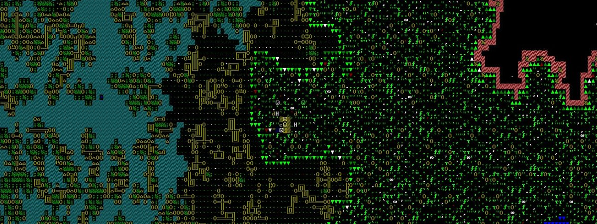
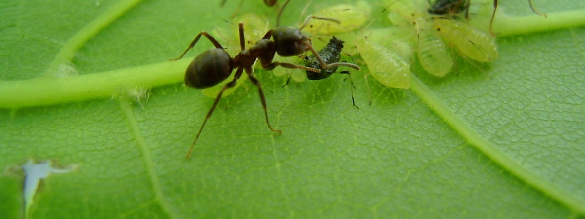
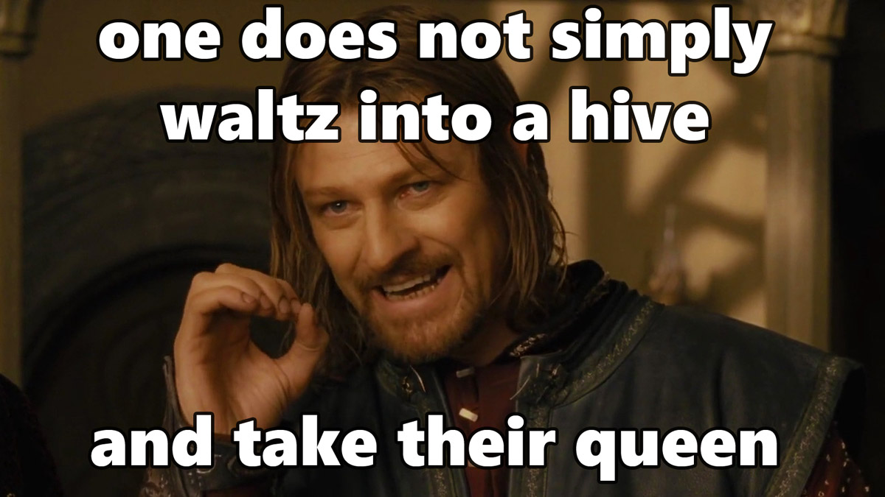
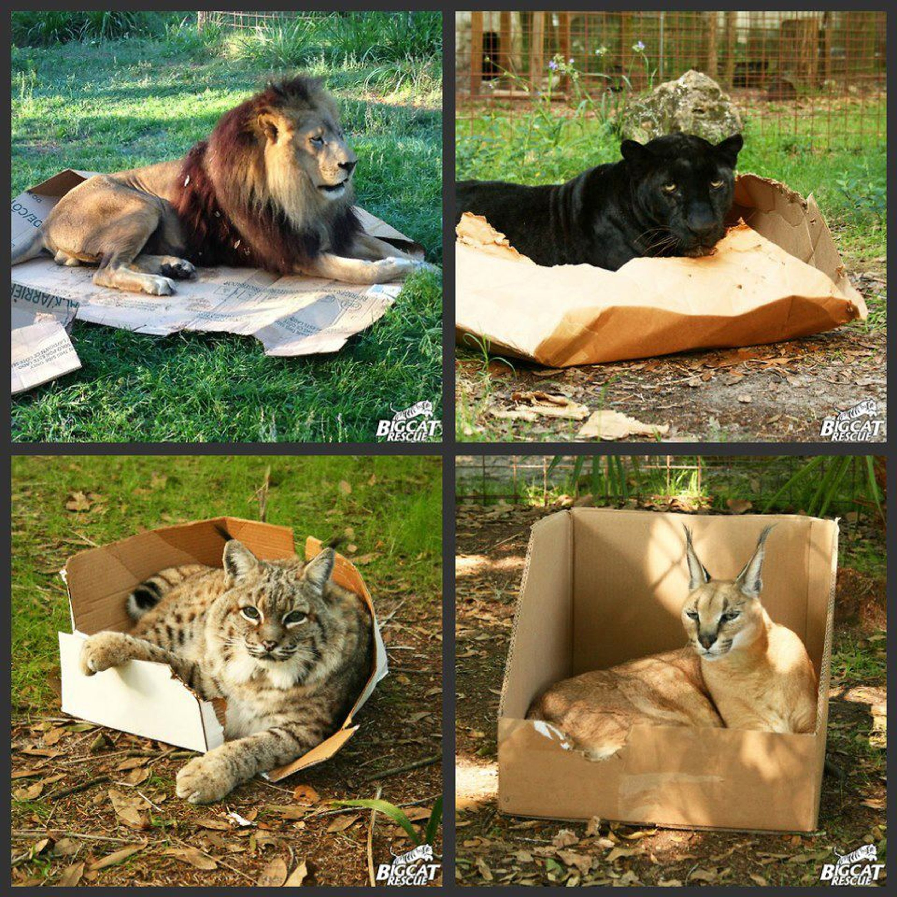

Dwarf Fortress is a popular complicated video game with a primitive graphical engine. It simulates complex behaviors to create a story, in which the player helps a group of dwarfs survive in an increasingly hostile world. Each dwarf has a mind of his own. The player directs the dwarfs by laying out plans for the construction of their fortress in such a way that their safety and basic needs are taken care of. The archive containing this game weighs 13.21 megabytes, which includes roughly 3 megabytes of data devoted to sound and graphics. Despite fitting its entire logic in under 10 megabytes of data, Dwarf Fortress has been dubbed the most complex computer game ever made. The number of its states and events is astronomical. Arguably, it simulates behaviors nearly as complicated as can be seen in animals sentient enough to communicate socially. This has got me thinking.

Biology is one of the last fields of science adopting the tech revolution by switching from analog to digital analysis. DNA has only recently been discovered. DNA sequencing is in its earliest stages. While chips calculating rocket trajectories have been around for years, CPUs have just gotten cheap and powerful enough to simulate biochemistry. Instead of studying life forms by their external analog behaviors and characteristics, we can now take a mathematical, digital, approach.

Driven by medical necessities, scientists have devoted their attention almost entirely to the "hardware" layer of animal anatomy. But, hereditary behaviors of multicellular organisms are just as essential to their well-being and breeding as their muscles and bones. Mammals, for example, are born with a set of complex phobias.

<aside>Mice are terrified of certain sounds and even [smells](http://www.sciencemag.org/news/2010/05/scent-makes-mice-run-scared). William Clark contends that fear has a major [genetic component](http://www.scientificamerican.com/article/is-our-tendency-to-experi/). Also, the [dodo bird](https://en.wikipedia.org/wiki/Dodo) went extinct due to lack of fear of predators.</aside>

Furthermore, the simpler the animal, the more it relies on pre-programmed instinct rather than on thoughts. This "software" should be somewhere in the animal's genetic bank, like this odd compulsion:

And here we have a problem. Scientists have found some genetic code that contributes to hereditary behaviors, but the bulk of it is unlikely to ever be found. Why? Because it plainly does not fit. There is not enough space to fit "software" hereditary behavioral definitions into DNA. If Dwarf Fortress comes close to encoding basic behavioral patterns requiring 10 megabytes of data, we must look for a chunk of genetic data of that size.

How much data can fit into DNA? Most animals run on diploid DNA. They have two sets of structurally compatible DNA: one from the father and another from the mother. Most DNA calculations on the web will present diploid figures. Beware, those numbers are misleading for our purposes. We are going to count only haploid base pairs. Father and mother of each creature must both carry nearly identical behavior information, because both must live and survive in order to reproduce.

One byte [encodes](http://bitesizebio.com/8378/how-much-information-is-stored-in-the-human-genome/) 4 DNA base pairs. Thus, human genome packs around 3.234 billion of base pairs in haploid genome, which is ~790Mb of data. A fire ant packs [480 million base pairs](http://www.pnas.org/content/108/14/5679.abstract), which is roughly 117Mb of data. Honey bee stashes [even less](https://www.nih.gov/news-events/news-releases/scientists-publish-analysis-honey-bee-genome): 260 million base pairs, which is roughly 63.5Mb of data. Even though genetic functions are newly discovered every month, there is a [stubborn scientific consensus](http://www.nytimes.com/2015/03/08/magazine/is-most-of-our-dna-garbage.html?_r=2) that even in functional genes the majority of encoded data is evolutionary junk. Also, animals often share vast sections of their DNA with other beings that behave quite differently. For example, humans share half of their DNA with the banana.

Even when behavior is mostly learned rather than hard-coded, the ability to learn itself must be hard-coded. Such code occupies hundreds of megabytes of data. Consider the first generation of software for self-driving cars. NVIDIA's deep-learning drivers for [self driving cars utilize](http://images.nvidia.com/content/tegra/automotive/images/2016/solutions/pdf/end-to-end-dl-using-px.pdf) "27 million connections and 250 thousand
parameters." Good programmers try to restrict their functions to no more than 6 parameters when writing code. Thus, a driving system with learning ability depends on over 40,000 programmatic functions. Those functions operate with only a dozen of sensors, wheels, and breaks. What if you had to write self-learning software for controlling all the muscle groups in an ant organism? Clearly it would require much more than 790mb for a human or **117mb** for an ant of data space to store.

# The Best Example

The ants are the best example for demonstrating the utter impossibility of fitting behavioral programming into DNA structures. Those little critters do a lot while having prohibitively small amount of ancestral memory on board. Ants have two stomachs, one personal and one social. The second is used to feed colony members that never leave the nest. They communicate with each other by pheromones and maintain some of the most complex symbiotic relationships with plants, fungi, bacteria, and other species of insects. They also seal their nest and secrete glycerol in winter months to prevent water crystals from forming in their bodies. They know to put their friends into sunlight to [thaw them after hibernation](http://blog.wildaboutants.com/tag/where-do-ants-go-in-the-winter/).

Most impressively, ants have been observed [kidnapping queens](http://rcin.org.pl/Content/57259/WA058_73493_P255-T45_Annal-Zool-Nr-6.pdf) if theirs die. They will even kidnap a queen from another ant species! Think about that for a second. This task requires a profound understanding of the condition of the home nest and a coordinated massive attack on the rival nest. Ants have to know how to concentrate their forces, overpower rival defenses, and have a way to identify the queen in huge enemy nests. And, they have to carry her home without killing her and introduce her to the other ants that stayed behind.

The "software" that runs the ant must include basic instincts, sensory recognition patterns, social interactions, spacial awareness, navigation routines, some learning ability, and threat estimation in its ancestral memory in addition to all the hardware schematics. Each muscle group must work in tandem with the senses. How much data would that amount of code require? **An easy way to estimate it is to simulate those behaviors on your computer.** Having some familiarity with multiple programming languages, I would guess that 117mb is totally insufficient for all that.

# Formal Argument

>1. simulating complex behavior requires at least 10mb of data
2. genes that guide behavior are quite rare and difficult to discover
3. creatures that are genetically close often turn out behaviorally divergent
4. even 10mb of behavioral data has not been spotted in any DNA

>**Conclusion:** most likely, instinctive behavior is primarily guided by something other than genetic information.

# Possible Objections

The most common robotic packages used today is the open source "[Robot Operating System](http://www.ros.org/about-ros/)." It is a modular software kit for programming a robot. The ROS file containing basic libraries just to get started weighs 1.4 gigabytes compressed! It would not even fit into human DNA.

It is difficult to estimate the size of Robot Operating System because it is modular. Their forums do not answer this question directly, but [one user put together an image for microcomputer Raspberry Pi](http://answers.ros.org/question/213490/where-can-i-publish-a-raspberry-pi-2-ros-indigo-iso-image/) that weighs 1.4 gigabytes compressed. Another user could not fit [the most basic system on 63mb partitions](http://answers.ros.org/question/238935/how-can-i-free-up-space-on-my-disks/).

Obviously, code can be greatly optimized, tightly compiled, and compressed. That is why 10mb binary file of Dwarf Fortress is a superior metric, as long as we assume that behavioral code of sentient creatures is better optimized than its encoding DNA. If behavioral DNA contains 40% to 90% junk, like the rest of DNA, than all estimates of the minimal expectations must be at least doubled.

Some primitive DNA compression mechanisms have already been discovered. If complex data compression is shown to play a major role in the life of an organism, my argument could be falsified. At the same time, the field of biology would be revolutionized. The degree of compression is inversely proportionate to the degree of data integrity when modifications are introduced. In other words, flipping one bit of a zipped file entails unpredictable modifications in many other places of the same file. And, random behavioral modifications to an otherwise healthy organism are potentially far more damaging to its ability to survive than small incremental changes to its "hardware."

Imagine being born genetically attracted to eating gravel or rotten meat like insects are born with hypnotizing interest in bright light. How long would you last in the wild? From the perspective of software engineering, mutation of compressed genetic code responsible for one behavior would inevitably entail simultaneous introduction of new behaviors elsewhere. Even if you are otherwise 100% physically healthy, multiple behavioral glitches are deadly and far less fault tolerant than physical modifications.

One might object that a negative proposition of the form "x does not explain y" is empirically indefensible. The form of my argument, however, follows another pattern: "there is not enough observable x in y." Such statements are empirically demonstrable and empirically falsifiable. For example, the statement "there are fewer than 10 goats in this wood" is empirical. Just search the wood to confirm it. By analogy, we should expect at least as many discoveries of genes controlling behaviors as we have for protein generation and regulatory genes. But we do not.

#### ID Disclaimer
I expect to get some emails loaded with objections inattentive to the argument. To save me time, I will link to this exact paragraph. This is not an argument for "Intelligent Design," although it may have some curious ramifications for ID. The argument assumes the entirety of present scientific consensus regarding evolution. The origins and the diversity of species are tangential subjects. This is the question of why creatures act the way they do, not how they came about to act the way they do.

# Conclusion

Computer science is revolutionizing the natural sciences. Philosophy is next. Our generation is already accepting of statements as deadly to 20th century materialism as the one [made recently by Elon Musk](http://www.independent.co.uk/life-style/gadgets-and-tech/news/elon-musk-ai-artificial-intelligence-computer-simulation-gaming-virtual-reality-a7060941.html): ~"Most certainly, we live in computer simulation." It is an amateurish statement because it is self-referential and can't be weighed against another similar statement, like saying "life is just a dream." Either statement is equally unfalsifiable and unprofitable. A better approach is to take the tangible with all seriousness. May we then discover the elusive repository of data that defines hereditary behavior? We may. Alternatively, we may come even closer to asserting the necessary existence of souls.
