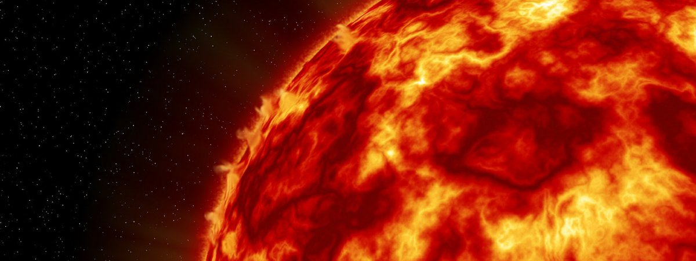

In March 2015, NASA scientists conducted a [ground-breaking experiment](https://www.nasa.gov/content/nasa-ames-reproduces-the-building-blocks-of-life-in-laboratory) that gave some hope to the viability of the "[RNA World Hypothesis](https://en.wikipedia.org/wiki/RNA_world)." They detected the formation of three common RNA components in ice exposed to ultraviolet radiation. It follows that there is a hint of possibility that life could have self-organized in common space conditions.

Next much needed experiment is the demonstration of possible cosmic conditions in which RNA chains can form freely out of RNA components. Finding such conditions is challenging because RNA formation requires suitable sources of energy in sufficient quantities. Is there a place in the universe where such conditions exist? May be. One place where they certainly did not exist until fairly recently is our solar system. This "energy problem" is the biggest hurdle for the RNA World Hypothesis to overcome. By extension, this problem also nullifies the possibility of every other common theory of abiogenesis including [autocatalitic sets](https://en.wikipedia.org/wiki/Autocatalytic_set). So what exactly is the problem?

In his classic work "Applied Cryptography," computer science expert Bruce Schneier illustrates the strength of common cryptographic algorithms by appealing to thermodynamics. Solving combinatorial problems that lie at the core of cryptographic algorithms by brute force requires gargantuan amounts of energy. Even if we had access to 100% efficient quantum computer, there is a certain absolute minimum amount of energy that is required to express and modify digital information. Schneier supposes, that if all of the energy of the Sun was harvested with a Dyson sphere and fed into a quantum computer, breaking a 256-bit password used for standard AES encryption would still be unfeasible. In other words, modern cryptographic algorithms are more secure than there is energy available for breaking them.

What does this mean for the RNA World Hypothesis? At its heart, this theory is also a combinatorial problem. A certain minimal chain must form in favorable conditions that can self-replicate for life to begin to emerge out of dead matter. This combinatorial problem, even if all the other requisite components are already present, also requires a certain minimal amount of energy to solve. Each RNA combination will consume chemical energy. Can this amount be estimated?

Yes! I will suggest one way to estimate the total minimal amount of chemical energy required for the birth of the first RNA viroid. I am sure others can do much better with such calculations. If you have more exact estimates, please tweet it my way @dkotik.

RNA pieces are linked by *PO4* [phosphodiester groups](https://en.wikipedia.org/wiki/Phosphodiester_bond), where oxygen forms a strong covalent bond with the RNA carbon on each side (DNA is held together the same way). If bond-dissociation energy at room temperature at this location is around 5 eV, it would minimally require `1.13e+130` joules to go through enough RNA combinations to birth the first primitive viroid. This estimate generously assumes that all this energy is available in nice chemical forms that help construct RNA rather than burn or poison or irradiate it.

It was assumed that the most primitive [RNA viroids](https://en.wikipedia.org/wiki/Viroid) are at least 246 nucleotides in length. If life emerged out of several components rather than one, but their total length is close to 246 nucleotides, the mathematical difficulty remains. For 246 nucleotides, there are 1.28e+148 (4^246) possible RNA combinations with each bond requiring at least 5 eV of energy at room temperature to form.

The heart of the matter is that our Sun has only channeled `2.52e+34` joules of energy to the surface of the Earth in 4.6 billion years. The energy in the Earth itself can be taken as barely sufficient to keep the ambient temperature high enough for the chemical reactions to be possible near its surface. Therefore, RNA combinatorial problem is to a certain degree comparable to the strength of modern encryption algorithms. Our star is too weak to challenge either.

<aside>What about stored nuclear energy? Total energy harvest of mankind from all sources for 2013 was around 5.67e+20 joules. If the Earth would yield this much energy every year since its conception for 4.6 billion years, it would still only amount to measly 2.61e+30 joules total. Not enough to even make a dent.</aside>
