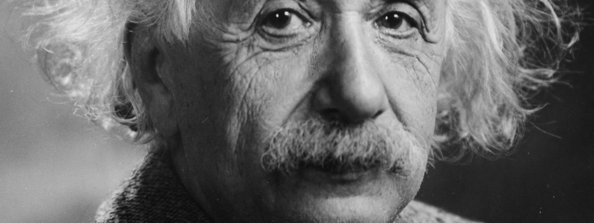

Einstein's peculiar political views show us how easily the best of us are tricked into idealism by people we trust. Albert Einstein is one of the most inspiring individuals of modernity, truly a revolutionary scientist and an icon of intellectualism. Lesser known are his strange political and philosophical views that unveil a botched and profoundly confused conscience. In his famous 1949 essay "[Why Socialism?](http://monthlyreview.org/2009/05/01/why-socialism/)", he argues that the greatest evil in the world is the capitalist economy. Capitalism, he insists, leads to the suppression of the individual and subsequent implosion of creativity. His proposed solution to this problem is planned economy coupled with an education program focused on social issues.

Given that socialism has many potential and actual merits, and that capitalism births many potential and actual vices, Einstein's understanding of both is infantile. He did not grasp the most basic ideas of either Karl Marx or John Lock. He begins his argument for planned economy by stating that all previous study in the field of economics is not applicable for designing or evaluating socialist economy of the future. Science is also useless here, because it cannot instill or motivate an ethical outcome. Tradition is useless because it precipitated in the wake of oppressive regimes. Selfishness guarantees that some societal evils are impossible to change. The only possible solution is planned economy, which Einstein immediately sinks at the end of his article by stating that the idea of planned economy by itself does not guarantee that a socialist bureaucracy does not become an oppressor.

Apart from eloquence, it is difficult to find anything of value in those musings. Thoughts are scattered, questions are raised and dropped unanswered, and stated objections are not in any way shown as endemic or exclusive to capitalism. Especially curious is his backhanded dismissal of mass media in capitalist society. The article does not contain any specific examples of anything discussed. To put it lightly, just about any communist columnist of the 20th century made better arguments for socialism than Einstein. Why?

We all are, capitalists and socialists, vulnerable to blinding idealism. Raw intellectual ability carries limited utility in unfamiliar territory. Einstein, being a genius in natural sciences, lacked the most basic skills in philosophy, sociology, and critical thinking. It is also a safe bet to say that his unmatched achievement may have precluded him from investigating and questioning ideas of people that he considered trustworthy. He became impressionable and easily placated into signing absurd political resolutions fed to him by lobbyists without any reservations ceaselessly until the end of his life.

When we do not see an obvious solution to a problem nearby, the most obscure and mysterious solution far away seems far better than any of the immediate alternatives. The less specific and understandable and remote the solution is, the more allure it often exudes. Einstein did not have a solution, he was parroting solutions offered by [Willi Munzenburg](http://www.academia.edu/437174/In_Control_of_Solidarity_Willi_M%C3%BCnzenberg_the_Workers_International_Relief_and_League_against_Imperialism_1921-1935) and Henri Barbusse. The former was the world's greatest propagandist and money launderer from Germany, the latter a French novelist enamored with Joseph Stalin. Tragically, Einstein became their sock puppet by his own will and cherished that opportunity.

Lesson? Complicated problems seldom yield to an ideal solution of any kind. Sophisticated people are just as easily tricked and manipulated as anybody else.

Sauce: [Google Books Dump](https://books.google.kz/books?id=_X0dAAAAQBAJ&pg=PA406&lpg=PA406&dq=einstein+munzenberg&source=bl&ots=4DQiU0C-1Uo&sig=B4tNLaSn0VW4gc4mTHZ__Yb_C_k&hl=en&sa=X&ei=pcIvVefBK7HmyQPyl3GwBw&ved=-1CDMQ5AEwBA#v=onepage&q=einstein%19munzenberg&f=false) on Einstein's political ideas.
